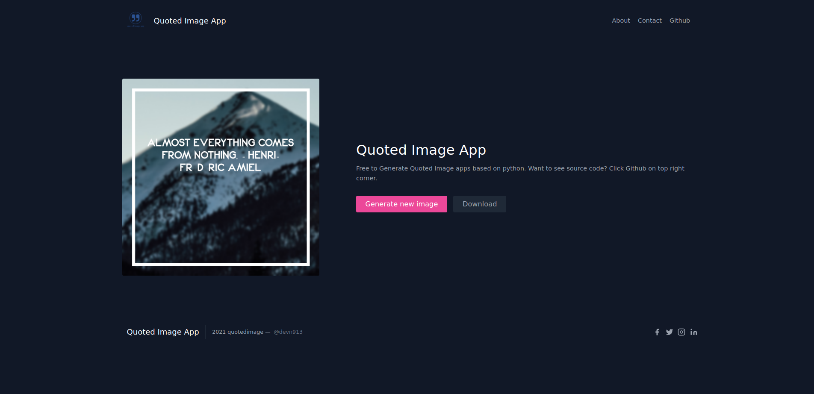
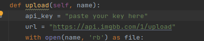

# Quoted Image App

<h4> Live example: </h4>

[https://quotedimage.herokuapp.com](https://quotedimage.herokuapp.com)

 

* Technology used
    * [Django](https://www.djangoproject.com/) (Web app)
    * [Pillow](https://pypi.org/project/Pillow/) (To Edit image using python)
    * [Unsplash Image API](https://source.unsplash.com/1000x1000) (To get images)
    * [Quote API](https://api.quotable.io/random) (To get quotes)
    * [Imgbb](https://imgbb.com/) - (To upload/host image)
    * [Tailblocks](https://tailblocks.cc/) - (Frontend)

<h2> Important: </h2>

* Get your own Image API key from [Key](https://api.imgbb.com/), if you are using it locally or for any development purpose and set variable "api_key" in "edit_image.py"
  otherwise app will not work.

* Star this if you liked my work

* I am open to any suggestions/help, contact here - [devnirwal16@gmail.com](mailto:devnirwal16@gmail.com)

